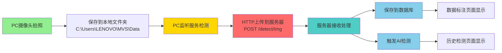

# PC端摄像头文件夹监听上传服务

## 📋 功能说明

该服务运行在**摄像头连接的PC上**,实现以下功能:

1. 监听PC本地摄像头文件夹 (`C:\Users\LENOVO\MVS\Data`)
2. 检测到新图片时,自动上传到服务器
3. 服务器接收后自动:
   - 保存到数据库
   - 触发AI检测
   - 同步到数据标注页面和历史检测页面

---

## 🚀 部署步骤

### **步骤1: 在PC上安装Node.js**

确保PC已安装Node.js (v14+):
```bash
node -v
npm -v
```

如未安装,从官网下载: https://nodejs.org/

---

### **步骤2: 安装依赖**

在PC的 `test` 目录下执行:

```bash
cd test
npm install axios chokidar form-data
```

---

### **步骤3: 配置服务器地址**

编辑 `pc-camera-watcher.js` 文件,修改配置:

```javascript
const CONFIG = {
  // PC本地监听的文件夹路径
  watchFolder: 'C:\\Users\\LENOVO\\MVS\\Data',  // 摄像头保存路径
  
  // 服务器地址 (修改为实际服务器IP)
  serverUrl: 'http://192.168.1.100:8081/detect/img',  // ⚠️ 改为服务器IP
  
  // 其他配置...
};
```

**查找服务器IP**:

在服务器上执行:
```bash
# Linux/Ubuntu
ip addr show

# Windows
ipconfig
```

找到局域网IP,例如 `192.168.1.100`

---

### **步骤4: 启动服务**

在PC的 `test` 目录下执行:

```bash
node pc-camera-watcher.js
```

**成功启动会看到**:
```
🚀 ==========================================
🚀 PC端摄像头文件夹监听服务已启动
🚀 ==========================================
📁 监听文件夹: C:\Users\LENOVO\MVS\Data
🌐 服务器地址: http://192.168.1.100:8081/detect/img
📷 支持格式: .jpg, .jpeg, .png, .bmp, .gif, .webp
🚀 ==========================================

👀 正在监听文件夹,等待新图片...
```

---

## 🔧 服务器端配置

### **确保服务器防火墙开放8081端口**

#### **Ubuntu/Linux**:
```bash
sudo ufw allow 8081
sudo ufw reload
```

#### **Windows Server**:
```powershell
netsh advfirewall firewall add rule name="Spring Boot 8081" dir=in action=allow protocol=TCP localport=8081
```

---

## 📊 完整工作流程



---

## 🎯 测试步骤

### **1. 测试网络连通性**

在PC的PowerShell中测试:
```powershell
# 测试服务器是否可达
Test-NetConnection -ComputerName 192.168.1.100 -Port 8081
```

或使用浏览器访问:
```
http://192.168.1.100:8081
```

### **2. 测试上传**

手动复制一张图片到监听文件夹:
```
C:\Users\LENOVO\MVS\Data\test.jpg
```

**PC监听服务会输出**:
```
🔔 [15:30:45] 检测到新文件: test.jpg
📤 [15:30:45] 正在上传: test.jpg
✅ [15:30:46] 上传成功: test.jpg
   服务器响应: 检测完成
```

**服务器日志会显示**:
```
接收图像
📸 处理图片: test.jpg
✅ AI检测完成,缺陷数: 2
```

**前端页面会显示**:
- 数据标注页面: 显示原始图片
- 历史检测页面: 显示检测结果

---

## ⚠️ 常见问题

### **问题1: 无法连接到服务器**
```
❌ 网络错误: 无法连接到服务器 http://192.168.1.100:8081/detect/img
```

**解决方法**:
1. 检查服务器IP是否正确
2. 确认服务器防火墙已开放8081端口
3. 确认服务器后端已启动
4. PC和服务器在同一局域网

### **问题2: HTTP 413错误 (文件太大)**
```
❌ HTTP状态: 413
```

**解决方法**:
已在之前配置中解决,如仍有问题,增加Spring Boot上传限制:
```yaml
spring:
  servlet:
    multipart:
      max-file-size: 100MB
      max-request-size: 100MB
```

### **问题3: 监听文件夹不存在**
```
❌ 监听文件夹不存在: C:\Users\LENOVO\MVS\Data
```

**解决方法**:
修改配置中的 `watchFolder` 为实际路径

---

## 🎉 后台运行(可选)

### **Windows后台运行**

使用 `pm2`:
```bash
npm install -g pm2
pm2 start pc-camera-watcher.js --name camera-watcher
pm2 save
pm2 startup
```

---

## 📝 日志说明

| 图标 | 含义 |
|------|------|
| 🔔 | 检测到新文件 |
| 📤 | 开始上传 |
| ✅ | 上传成功 |
| ❌ | 上传失败 |
| 🔄 | 正在重试 |
| ⏭️ | 跳过文件 |

---

## 🔐 安全建议

1. 建议使用HTTPS (生产环境)
2. 可添加Token认证
3. 限制上传文件大小
4. 添加访问IP白名单

---

现在您可以开始使用了! 🚀
